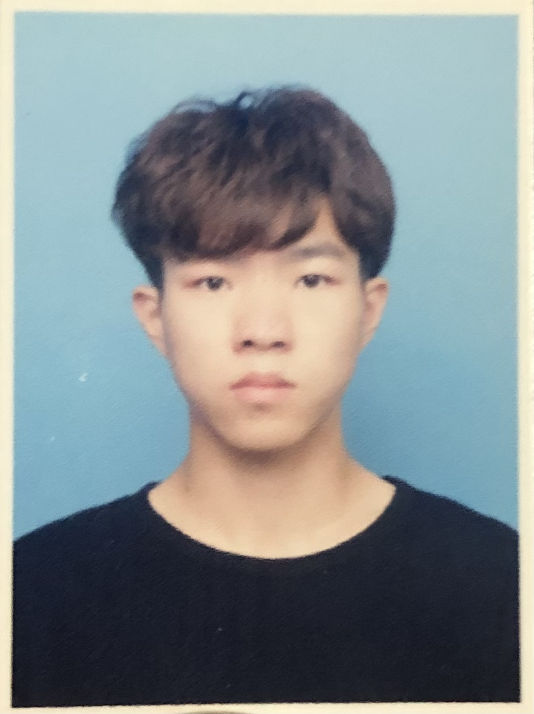

# 个人信息

 - 邓小虎 / 男 / 1998 
 - 本科 / 武汉华夏理工学院电子信息专业 
 - 硕士 / 湖南师范大学电子信息专硕 
 
---
# 联系方式

- 手机：17307417513 
- Email：1347355127@qq.com 
- QQ/微信号：-HughWilliams

---
# 研究方向与个人技能

- 研究方向：机器学习、深度学习，计算机视觉。目标检测、分割，蒸馏学习等。
- 英语：CET6
- 驾驶证：C1

---
# 项目经历

## 1.航天降落伞线迹质量检测系统 
### 公司：北京空间技术研究院508所
### 时间：2023年2月-2023年7月
### 项目描述：设计了一套航天降落伞缝纫线迹质量检测系统，实现对线迹的质量评估以及对缺陷快速、准确的检测，以代替传统人工检测的方法，极大地提高了检测效率、降低人工成本。在本项目中，负责检测算法的实现和落地，解决了不同线迹聚类的难题，并生成简洁、直观的评估结果供用户查看。协同工作于一个跨职能团队，与前端开发人员、测试工程师和产品经理紧密合作，确保项目按计划和要求完成。
### 技术和工具：Python、Pytorch、Labelme、Visual Studio Code、Anaconda、Cuda

## 2.水体藻类检测
### 公司：力合科技(湖南)股份有限公司
### 时间：2022年6月-2022年12月
### 项目描述：参与藻类显微图像的精准识别工程项目，并成功运用实施。主要负责藻类显微图像目标检测算法的框架逻辑和工程代码实现。同时为公司的Linux服务器搭建好深度学习环境。藻类显微图像目标检测算法：基于YOLOv5的原理方法，使用Pytorch框架搭建代码结构，通过修改网络模型和优化部分算法实现藻类显微图像精准识别与计数，同时进行算法的部署实现和工程应用，打造了一套完整的藻类显微图像识别系统。
### 技术和工具：Python、Pytorch、Labelme、Pycharm、Linux、Anaconda、Cuda

---
# 论文、软著及竞赛经历
### 湖南师范大学研究生学业奖学金三等奖
### 全国大学生英语竞赛三等奖
### 湖北省翻译大赛三等奖
### 中国研究生人工智能创新大赛二等奖
### 软著《航天降落伞缝纫质量视觉检测软件》
### 《Adaptive Semantic Segmentation in Adverse Weather via Dual-alignment-based Pseudo-Label Optimization》一作（CAA A类会议）
